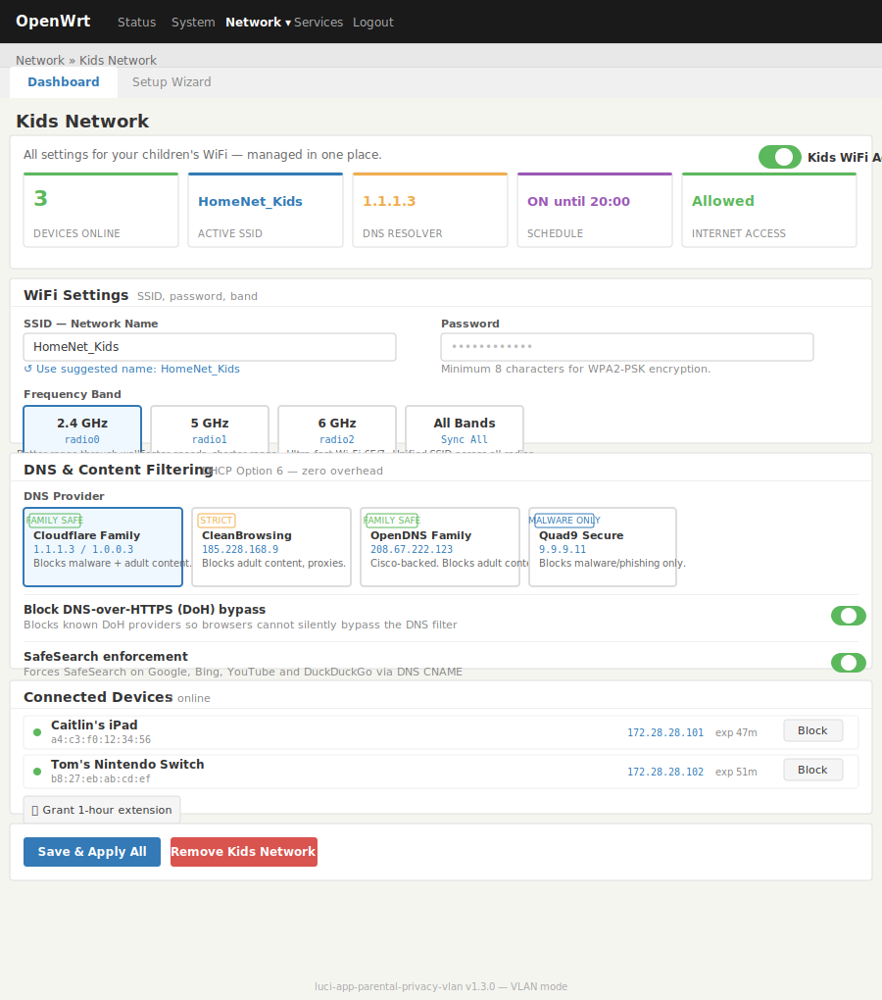
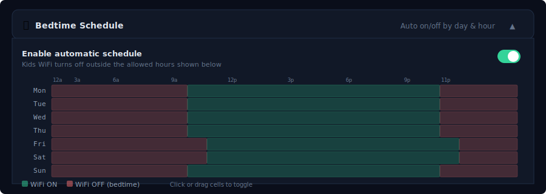

# luci-app-parental-privacy

A LuCI application for OpenWrt that creates a fully isolated **Kids WiFi network** with content filtering, bedtime scheduling, bandwidth limits, and a hardware kill-switch — all manageable from a single dashboard.



---

## Features

- **Isolated network** — Kids devices run on a dedicated subnet (`172.28.10.0/24`) behind a firewall zone, completely separated from your home LAN
- **Protective DNS** — Choose from Cloudflare Family, CleanBrowsing, OpenDNS, Quad9, or AdGuard; delivered via DHCP Option 6 with zero performance overhead
- **DoH blocking** — Prevents browsers from bypassing the DNS filter using DNS-over-HTTPS (blocks Cloudflare, Google, Quad9 DoH endpoints via nftables/iptables)
- **Bedtime schedule** — Drag-and-drop weekly grid writes cron jobs to turn WiFi on/off automatically
- **Bandwidth limiting** — Per-network rate cap using `tc` HTB + `fq_codel` (e.g. 10 Mbit/s)
- **Hardware kill-switch** — Assign a physical router button (WPS, reset, or GL.iNet slider) to instantly toggle the Kids network
- **1-hour extension** — Parents can grant a one-hour override from the dashboard without touching the schedule
- **Tri-band support** — Manages 2.4 GHz, 5 GHz, and 6 GHz (WPA3/SAE) radios in sync
- **Setup Wizard** — Three-step guided wizard for first-time configuration

---

## Screenshots

### Dashboard


The main dashboard shows live device count, active SSID, current DNS resolver, and next schedule event — plus collapsible panels for every setting.

### Bedtime Schedule



Click or drag cells on the weekly grid to define allowed hours. Quick presets include School Days, Strict, and Weekends Only. Changes are written directly to `/etc/crontabs/root`.

### Setup Wizard


The three-step wizard walks through primary DNS selection, Kids WiFi credentials, and optional hardware button assignment. Existing config is never overwritten.

---

## Requirements

| Dependency | Purpose |
|---|---|
| `luci-base` | LuCI framework |
| `tc-full` | Bandwidth limiting via HTB qdisc |
| `kmod-sched-core` | Kernel traffic shaping module |
| `nftables` | DoH blocking firewall rules (falls back to iptables) |

OpenWrt 22.03 or later recommended. Works on 21.02 with iptables fallback.

---

## Installation

### From the packages feed (once merged)

```sh
opkg update
opkg install luci-app-parental-privacy
```

### Manual install (ipk)

Download the latest release `.ipk` from the [Releases](https://github.com/eddwatts/luci-app-parental-privacy/releases) page, copy it to your router, and run:

```sh
opkg install luci-app-parental-privacy_1.0.0_all.ipk
```

### Build from source

Clone this repo into your OpenWrt buildroot packages feed:

```sh
cd /path/to/openwrt
git clone https://github.com/eddwatts/luci-app-parental-privacy.git package/luci-app-parental-privacy
make menuconfig   # select LuCI > Applications > luci-app-parental-privacy
make package/luci-app-parental-privacy/compile
```

---

## What gets installed

| File | Destination |
|---|---|
| `parental_privacy.lua` | `/usr/lib/lua/luci/controller/` |
| `kids_network.htm` | `/usr/lib/lua/luci/view/parental_privacy/` |
| `wizard.htm` | `/usr/lib/lua/luci/view/parental_privacy/` |
| `luci-app-parental-privacy.json` | `/usr/share/rpcd/acl.d/` |
| `bandwidth.sh` | `/usr/share/parental-privacy/` |
| `block-doh.sh` | `/usr/share/parental-privacy/` |
| `99-parental-privacy` | `/etc/uci-defaults/` (runs once on first boot) |
| `30-kids-wifi` | `/etc/hotplug.d/button/` |

The `99-parental-privacy` uci-defaults script runs once at first boot to create the `kids` network interface, DHCP pool, firewall zone, DNS redirect rule, and wireless interfaces for all detected bands. It does not overwrite any existing configuration.

---

## First-time setup

After installing, navigate to **Network → Kids Network → Setup Wizard** in the LuCI web interface. The wizard covers:

1. **Primary DNS** — optionally upgrade your main network to a protective resolver
2. **Kids WiFi** — set SSID, password, DNS, and which band(s) to use
3. **Hardware button** — optionally assign a physical button to toggle the network

The dashboard is then available at **Network → Kids Network**.

---

## Hardware button

The hotplug script at `/etc/hotplug.d/button/30-kids-wifi` handles:

- **GL.iNet slider** (`BTN_0`) — each position maps to on/off
- **WPS button** — single press toggles the network
- **All bands in sync** — toggles `kids_wifi`, `kids_wifi_5g`, and `kids_wifi_6g` together

To find your router's button name, check the [OpenWrt Hardware Wiki](https://openwrt.org/toh/start) for your model, then set the GPIO pin in the dashboard under **Hardware Kill-Switch**.

---

## Network architecture

```
Internet
    │
  [WAN]
    │
 OpenWrt router
    ├── br-lan  (192.168.1.x)   ← your home devices
    └── br-kids (172.28.10.x)   ← isolated kids network
            │
        Firewall zone: kids
            ├── Input:   REJECT  (except DHCP, DNS, ICMP)
            ├── Forward: REJECT  → WAN only
            └── DNS intercepted: all port-53 traffic redirected to dnsmasq
```

Kids devices receive DNS via DHCP Option 6. A DNAT rule redirects any attempt to use a different DNS server back to the router. DoH blocking prevents browsers from encrypting around the filter entirely.

---

## License

GPL-2.0-or-later — see [LICENSE](LICENSE)

## Maintainer

Edward Watts
